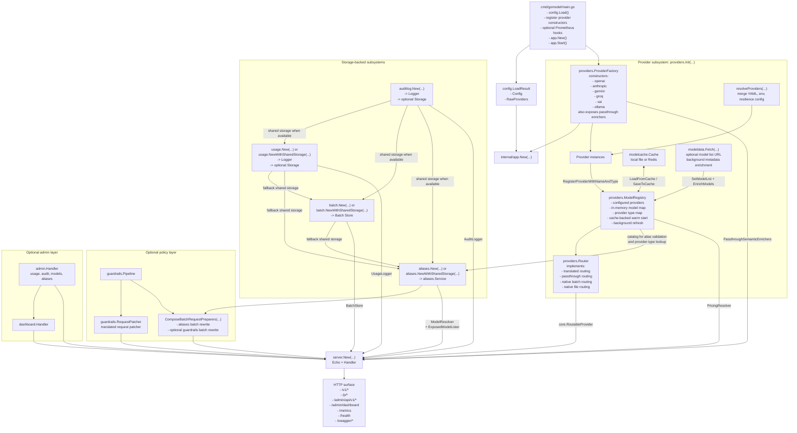
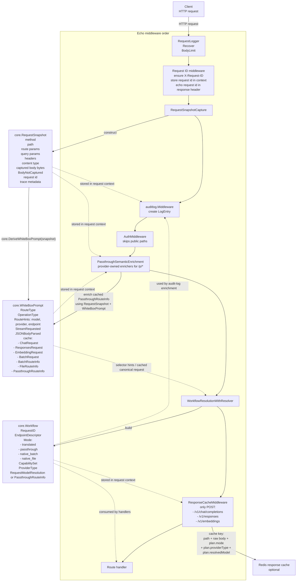
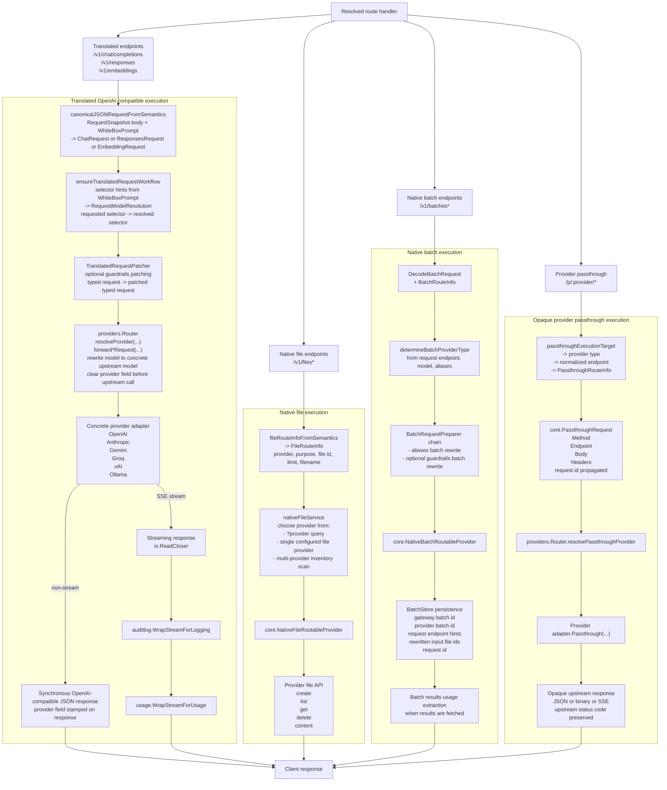

# GoModel Architecture Snapshot

This document is a point-in-time architecture snapshot based on the code and runtime wiring present on March 16, 2026.

It is not a statement of the intended architectural direction. It is a snapshot of how the system is structured as of that date.

It focuses on:

- what is instantiated at boot
- how requests move through the gateway
- what data objects are passed between layers
- where `RequestSnapshot`, `WhiteBoxPrompt`, and `Workflow` are created and consumed

## 1. Boot And Dependency Wiring

## 2. Request-Scoped Data Objects

| Object            | Created by                                                                      | Contains                                                                                                                                                              | Consumed by                                                                                                            |
| ----------------- | ------------------------------------------------------------------------------- | --------------------------------------------------------------------------------------------------------------------------------------------------------------------- | ---------------------------------------------------------------------------------------------------------------------- |
| `RequestSnapshot` | `RequestSnapshotCapture()`                                                      | Immutable ingress transport data: method, path, route params, query params, headers, content type, captured body bytes, `BodyNotCaptured`, request id, trace metadata | `DeriveWhiteBoxPrompt`, audit logging, passthrough semantic enrichers, any later logic that needs raw ingress fidelity |
| `WhiteBoxPrompt`  | `core.DeriveWhiteBoxPrompt(snapshot)`                                           | Best-effort semantics: route type, operation type, route hints, stream intent, JSON parsed flag, cached typed request objects, cached route metadata                  | workflow resolution, canonical request decoding, passthrough/file/batch helpers                                        |
| `Workflow`        | `WorkflowResolutionWithResolver(...)` or `ensureTranslatedRequestWorkflow(...)` | Control-plane decision: endpoint descriptor, execution mode, capabilities, provider type, resolved model selector, passthrough info                                   | response cache, translated handlers, passthrough handlers, audit-log enrichment                                        |

Important constraints:

- `RequestSnapshot` is transport-first and must not be mutated.
- `WhiteBoxPrompt` is best-effort and may be partial or absent.
- `Workflow` is request-scoped control-plane state, not raw transport state.
- Streaming response frames are not part of `RequestSnapshot`.

## 3. Model-Facing Request Lifecycle

This pipeline applies to ingress-managed model routes such as:

- `/v1/chat/completions`
- `/v1/responses`
- `/v1/embeddings`
- `/v1/batches*`
- `/v1/files*`
- `/p/:provider/*`

It does not apply to `/health`, `/metrics`, `/swagger/*`, admin UI assets, or `GET /v1/models`.

## 4. Execution Branches After Routing

## 5. What Is Passed Where

Translated request path:

1. HTTP ingress data becomes `RequestSnapshot`.
2. `RequestSnapshot` becomes `WhiteBoxPrompt`.
3. `WhiteBoxPrompt` plus request body decoding becomes a typed request such as `*core.ChatRequest`.
4. `WhiteBoxPrompt` selector hints plus alias resolution become `RequestModelResolution`.
5. `RequestModelResolution` becomes part of `Workflow`.
6. `Workflow` drives:
   - response-cache keying
   - provider selection
   - audit-log enrichment
   - usage attribution
7. `providers.Router` rewrites the outgoing request to the concrete upstream model and clears the provider field before invoking the provider adapter.
8. The provider adapter returns either:
   - a typed OpenAI-compatible response object
   - an `io.ReadCloser` SSE stream

Passthrough request path:

1. HTTP ingress data becomes `RequestSnapshot`.
2. `RequestSnapshot` becomes `WhiteBoxPrompt`.
3. Provider-owned passthrough enrichment can add `PassthroughRouteInfo` such as normalized endpoint, semantic operation, or model hints.
4. `Workflow` is created in `passthrough` mode with `ProviderType` and `PassthroughRouteInfo`.
5. The handler converts the live request into `*core.PassthroughRequest`:
   - `Method`
   - normalized `Endpoint`
   - live `Body`
   - forwarded `Headers`
6. The selected provider adapter executes the opaque upstream request and the gateway proxies the upstream response back to the client.

Batch request path:

1. The request body is decoded into `*core.BatchRequest`.
2. Batch provider type is determined from request semantics plus alias policy.
3. The batch preparer chain can rewrite input files or per-item request payloads.
4. The native batch router sends the prepared request to the selected provider.
5. The gateway persists its own batch id plus provider ids and request-endpoint hints in `BatchStore`.

File request path:

1. Transport and multipart/query/path data become `FileRouteInfo`.
2. `nativeFileService` resolves the provider from query parameters or provider inventory.
3. The native file router forwards to the selected provider file API.

## 6. Side Paths Outside The Main Ingress Pipeline

- `GET /v1/models`: `Handler.ListModels` calls `providers.Router.ListModels()` and then merges alias-exposed models from `aliases.Service`.
- `/admin/api/v1/*`: reads usage and audit storage, model registry, and alias service through `admin.Handler`.
- `/admin/dashboard`: dashboard UI handler over the same underlying readers.
- `/metrics`: Prometheus endpoint when enabled.
- `/health`: simple health check.
- `/swagger/*`: Swagger UI when enabled.
