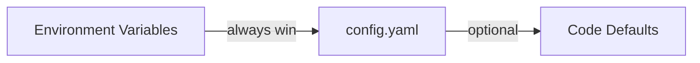

## Good defaults

GoModel uses a good defaults philosophy. This means that the default settings should be enough to use it.

## How to override the default settings?

We use a three-layer configuration pipeline. Every setting has a sensible default, so you can start the server with zero configuration.

{/* Environment Variables (always win) → config.yaml (optional) → Code Defaults */}



<Tip>
  As GoModel works out of the box with no configuration files, you can try it in
  a minute.

Start here: [Quick Start](/getting-started/quickstart)

</Tip>

GoModel automatically discovers providers from well-known environment variables.

## Configuration Methods

### 1. Environment Variables

The most common way to configure GoModel. Set any of the variables below to override defaults.

#### Server

| Variable             | Description                                           | Default                |
| -------------------- | ----------------------------------------------------- | ---------------------- |
| `PORT`               | HTTP server port                                      | `8080`                 |
| `GOMODEL_MASTER_KEY` | Authentication key for securing the gateway           | _(empty, unsafe mode)_ |
| `BODY_SIZE_LIMIT`    | Max request body size (e.g., `10M`, `1024K`, `500KB`) | _(no limit)_           |

#### Cache

| Variable            | Description                       | Default          |
| ------------------- | --------------------------------- | ---------------- |
| `GOMODEL_CACHE_DIR` | Directory for local cache files   | `.cache`         |
| `REDIS_URL`         | Redis connection URL              | _(empty)_        |
| `REDIS_KEY_MODELS`     | Redis key for model cache           | `gomodel:models`    |
| `REDIS_KEY_RESPONSES`  | Redis key for response cache        | `gomodel:response:` |
| `REDIS_TTL_MODELS`     | TTL in seconds for model cache      | `86400` (24h)    |
| `REDIS_TTL_RESPONSES`  | TTL in seconds for response cache   | `3600` (1h)      |

<Tip>
  See [Cache](/features/cache) for exact-cache behavior, response headers,
  analytics endpoints, and the note that `user_path` alone does not partition
  the exact cache.
</Tip>

#### Storage

Storage is shared by audit logging, usage tracking, and future features like IAM.

| Variable             | Description                                   | Default           |
| -------------------- | --------------------------------------------- | ----------------- |
| `STORAGE_TYPE`       | Backend: `sqlite`, `postgresql`, or `mongodb` | `sqlite`          |
| `SQLITE_PATH`        | SQLite database file path                     | `data/gomodel.db` |
| `POSTGRES_URL`       | PostgreSQL connection string                  | _(empty)_         |
| `POSTGRES_MAX_CONNS` | PostgreSQL connection pool size               | `10`              |
| `MONGODB_URL`        | MongoDB connection string                     | _(empty)_         |
| `MONGODB_DATABASE`   | MongoDB database name                         | `gomodel`         |

#### Audit Logging

| Variable                          | Description                                | Default |
| --------------------------------- | ------------------------------------------ | ------- |
| `LOGGING_ENABLED`                 | Enable audit logging                       | `false` |
| `LOGGING_LOG_BODIES`              | Log request/response bodies                | `true`  |
| `LOGGING_LOG_HEADERS`             | Log headers (sensitive ones auto-redacted) | `true`  |
| `LOGGING_ONLY_MODEL_INTERACTIONS` | Only log AI model endpoints                | `true`  |
| `LOGGING_BUFFER_SIZE`             | In-memory buffer before flush              | `1000`  |
| `LOGGING_FLUSH_INTERVAL`          | Flush interval in seconds                  | `5`     |
| `LOGGING_RETENTION_DAYS`          | Auto-delete after N days (0 = forever)     | `30`    |

<Warning>
  When `LOGGING_LOG_BODIES` is enabled, request and response bodies are stored
  in full. These may contain sensitive data such as PII or API keys embedded in
  prompts.
</Warning>

#### Token Usage Tracking

| Variable                       | Description                                    | Default |
| ------------------------------ | ---------------------------------------------- | ------- |
| `USAGE_ENABLED`                | Enable token usage tracking                    | `true`  |
| `ENFORCE_RETURNING_USAGE_DATA` | Auto-add `include_usage` to streaming requests | `true`  |
| `USAGE_BUFFER_SIZE`            | In-memory buffer before flush                  | `1000`  |
| `USAGE_FLUSH_INTERVAL`         | Flush interval in seconds                      | `5`     |
| `USAGE_RETENTION_DAYS`         | Auto-delete after N days (0 = forever)         | `90`    |

#### Metrics

| Variable           | Description               | Default    |
| ------------------ | ------------------------- | ---------- |
| `METRICS_ENABLED`  | Enable Prometheus metrics | `false`    |
| `METRICS_ENDPOINT` | HTTP path for metrics     | `/metrics` |

#### Admin

| Variable                  | Description                   | Default |
| ------------------------- | ----------------------------- | ------- |
| `ADMIN_ENDPOINTS_ENABLED` | Enable the admin REST API     | `true`  |
| `ADMIN_UI_ENABLED`        | Enable the admin dashboard UI | `true`  |

#### HTTP Client

These control timeouts for upstream API requests to LLM providers.

| Variable                       | Description                                  | Default        |
| ------------------------------ | -------------------------------------------- | -------------- |
| `HTTP_TIMEOUT`                 | Overall request timeout in seconds           | `600` (10 min) |
| `HTTP_RESPONSE_HEADER_TIMEOUT` | Time to wait for response headers in seconds | `600` (10 min) |

#### Provider API Keys

Set these to automatically register providers. No YAML configuration required.

| Variable             | Provider                                           |
| -------------------- | -------------------------------------------------- |
| `OPENAI_API_KEY`     | OpenAI                                             |
| `ANTHROPIC_API_KEY`  | Anthropic                                          |
| `GEMINI_API_KEY`     | Google Gemini                                      |
| `OPENROUTER_API_KEY` | OpenRouter                                         |
| `ZAI_API_KEY`        | Z.ai                                               |
| `XAI_API_KEY`        | xAI (Grok)                                         |
| `GROQ_API_KEY`       | Groq                                               |
| `AZURE_API_KEY`      | Azure OpenAI (`AZURE_BASE_URL` also required)     |
| `ORACLE_API_KEY`     | Oracle (`ORACLE_BASE_URL` also required)          |
| `OLLAMA_BASE_URL`    | Ollama (no API key needed)                        |
| `VLLM_BASE_URL`      | vLLM (no API key needed unless upstream requires) |

Most providers can use a custom base URL via `<PROVIDER>_BASE_URL` (for example `OPENAI_BASE_URL`). OpenRouter defaults to `https://openrouter.ai/api/v1` and can be overridden with `OPENROUTER_BASE_URL`. Z.ai defaults to `https://api.z.ai/api/paas/v4`; set `ZAI_BASE_URL=https://api.z.ai/api/coding/paas/v4` for the GLM Coding Plan endpoint. vLLM defaults to `http://localhost:8000/v1` when `VLLM_API_KEY` is set, but keyless deployments should set `VLLM_BASE_URL` explicitly to register the provider. Azure uses `AZURE_BASE_URL` for its deployment base URL and accepts an optional `AZURE_API_VERSION` override; otherwise it defaults to `2024-10-21`. Oracle requires `ORACLE_BASE_URL` because its OpenAI-compatible endpoint is region-specific.

Every provider type also accepts a comma-separated configured model list via
`<PROVIDER>_MODELS`, for example `OPENROUTER_MODELS`, `ORACLE_MODELS`,
`AZURE_MODELS`, or `VLLM_MODELS`. By default,
`CONFIGURED_PROVIDER_MODELS_MODE=fallback` uses configured lists only when
upstream `/models` fails, returns nil, or returns an empty list. Set
`CONFIGURED_PROVIDER_MODELS_MODE=allowlist` to expose only configured models for
providers that define a list and skip their upstream `/models` calls. YAML
`providers.<name>.models` provides the same model-list input for named provider
blocks.

For OpenRouter, GoModel also sends default attribution headers unless the request already sets them. Override those defaults with `OPENROUTER_SITE_URL` and `OPENROUTER_APP_NAME`.

### 2. `.env` File

GoModel automatically loads a `.env` file from the working directory at startup. This is convenient for local development.

```bash
# .env
PORT=3000
OPENAI_API_KEY=sk-...
ANTHROPIC_API_KEY=sk-ant-...
```

Copy `.env.template` to `.env` and uncomment the values you need:

```bash
cp .env.template .env
```

<Note>
  Real environment variables always override values from the `.env` file. The
  `.env` file is only loaded if it exists — missing it is not an error.
</Note>

### 3. Configuration File (YAML)

For more complex setups, you can use an optional YAML configuration file. GoModel looks for it in two locations (in order):

1. `config/config.yaml`
2. `config.yaml`

If you are deciding whether you need YAML at all, see
[config.yaml](/advanced/config-yaml).

To get started, copy the example:

```bash
cp config/config.example.yaml config/config.yaml
```

Then uncomment and edit the settings you want to change:

```yaml
server:
  port: "3000"
  master_key: "my-secret-key"

cache:
  model:
    redis:
      url: "redis://my-redis:6379"

providers:
  openai:
    type: openai
    api_key: "sk-..."

  anthropic:
    type: anthropic
    api_key: "sk-ant-..."

  # Custom OpenAI-compatible provider
  my-custom-llm:
    type: openai
    base_url: "https://api.example.com/v1"
    api_key: "..."
```

The YAML file supports environment variable expansion using `${VAR}` and `${VAR:-default}` syntax:

```yaml
server:
  port: "${PORT:-8080}"

providers:
  openai:
    type: openai
    api_key: "${OPENAI_API_KEY}"
```

<Tip>
  The YAML file is entirely optional. Any setting you can put in YAML can also
  be set via environment variables. Use YAML when you need per-provider
  resilience overrides, generated provider names are not enough, or you prefer
  a structured config file.
</Tip>

## Provider Configuration

### Auto-Discovery from Environment Variables

The simplest way to add providers. GoModel checks for well-known API key environment variables and automatically registers providers:

```bash
export OPENAI_API_KEY="sk-..."      # Registers "openai" provider
export ANTHROPIC_API_KEY="sk-ant-..." # Registers "anthropic" provider
export GEMINI_API_KEY="..."          # Registers "gemini" provider
export XAI_API_KEY="..."             # Registers "xai" provider
export GROQ_API_KEY="gsk_..."        # Registers "groq" provider
export OPENROUTER_API_KEY="sk-or-..." # Registers "openrouter" provider
export ZAI_API_KEY="..."             # Registers "zai" provider
# Optional: export ZAI_BASE_URL="https://api.z.ai/api/coding/paas/v4"
export AZURE_API_KEY="..."           # Registers "azure" provider when paired with AZURE_BASE_URL
export AZURE_BASE_URL="https://your-resource.openai.azure.com/openai/deployments/your-deployment"
export ORACLE_API_KEY="..."          # Registers "oracle" provider when paired with ORACLE_BASE_URL
export ORACLE_BASE_URL="https://inference.generativeai.us-chicago-1.oci.oraclecloud.com/20231130/actions/v1"
export ORACLE_MODELS="openai.gpt-oss-120b,xai.grok-3" # Optional configured model list
export OPENROUTER_MODELS="openai/gpt-oss-120b,anthropic/claude-sonnet-4"
export CONFIGURED_PROVIDER_MODELS_MODE="fallback" # fallback or allowlist
export OLLAMA_BASE_URL="http://localhost:11434/v1" # Registers "ollama" provider
export VLLM_BASE_URL="http://localhost:8000/v1" # Registers keyless "vllm" provider
# Optional: export VLLM_API_KEY="token-abc123"
```

Use suffixed variables to register more than one instance of the same provider
type without YAML. GoModel normalizes the suffix to lowercase and converts
underscores to hyphens in the configured provider name:

```bash
export OPENAI_EAST_API_KEY="sk-..." # Registers "openai-east", type "openai"
export OPENAI_EAST_BASE_URL="https://east.example.com/v1"

export OPENAI_WEST_API_KEY="sk-..." # Registers "openai-west", type "openai"
export OPENAI_WEST_BASE_URL="https://west.example.com/v1"
```

The same pattern works for every registered provider type:
`<PROVIDER>_<SUFFIX>_API_KEY`, `<PROVIDER>_<SUFFIX>_BASE_URL`, and
`<PROVIDER>_<SUFFIX>_MODELS`. Azure also supports
`<PROVIDER>_<SUFFIX>_API_VERSION`. Azure and Oracle still require their
suffixed `BASE_URL` values because their endpoints are deployment- or
region-specific.

### YAML Provider Blocks

For more control (custom names, per-provider resilience, or larger structured
settings), use the YAML file:

```yaml
models:
  # fallback is the default. Use allowlist when configured provider model lists
  # should hide upstream models and skip upstream /models calls.
  configured_provider_models_mode: fallback

providers:
  # Override OpenAI base URL
  openai:
    type: openai
    api_key: "sk-..."
    base_url: "https://my-proxy.example.com/v1"

  # Add a second OpenAI-compatible endpoint
  azure:
    type: azure
    base_url: "https://my-resource.openai.azure.com/openai/deployments/gpt-4"
    api_key: "..."
    api_version: "2024-10-21"

  # Add Oracle's OpenAI-compatible endpoint
  oracle:
    type: oracle
    base_url: "https://inference.generativeai.us-chicago-1.oci.oraclecloud.com/20231130/actions/v1"
    api_key: "..."
    models:
      - openai.gpt-oss-120b
      - xai.grok-3

  # Add a vLLM OpenAI-compatible server
  vllm:
    type: vllm
    base_url: "http://localhost:8000/v1"
    # api_key is optional; set it only when vllm serve uses --api-key.
    # api_key: "token-abc123"

  # Configure a model list for fallback or allowlist mode
  gemini:
    type: gemini
    api_key: "..."
    models:
      - gemini-2.0-flash
      - gemini-1.5-pro
```

<Note>
  `models:` works for every provider block. In fallback mode it is a safety net
  when upstream `/models` is unavailable or empty. In allowlist mode it becomes
  the exposed inventory for that provider and skips upstream `/models`. For Oracle, see the [Oracle
  guide](/guides/oracle) for the required OCI policy and a tested configuration.
</Note>

### Ollama (Local Models)

Ollama does not require an API key. Set the base URL to enable it:

```bash
export OLLAMA_BASE_URL="http://localhost:11434/v1"
```

Or in YAML:

```yaml
providers:
  ollama:
    type: ollama
    base_url: "http://localhost:11434/v1"
```

### vLLM

vLLM uses its OpenAI-compatible `/v1` API. In Docker, set `VLLM_BASE_URL` to
register a keyless vLLM server:

```bash
docker run --rm -p 8080:8080 \
  -e GOMODEL_MASTER_KEY="change-me" \
  -e VLLM_BASE_URL="http://host.docker.internal:8000/v1" \
  enterpilot/gomodel
```

If the upstream server was started with `vllm serve ... --api-key token-abc123`,
also set:

```bash
docker run --rm -p 8080:8080 \
  -e GOMODEL_MASTER_KEY="change-me" \
  -e VLLM_BASE_URL="http://host.docker.internal:8000/v1" \
  -e VLLM_API_KEY="token-abc123" \
  enterpilot/gomodel
```

You can also register more than one vLLM instance without YAML:

```bash
docker run --rm -p 8080:8080 \
  -e GOMODEL_MASTER_KEY="change-me" \
  -e VLLM_BASE_URL="http://host.docker.internal:8000/v1" \
  -e VLLM_TEST_BASE_URL="http://host.docker.internal:8000/v1" \
  enterpilot/gomodel
```

This registers providers `vllm` and `vllm-test`. Use YAML only when the
generated provider names are not enough or you need a larger structured block.
